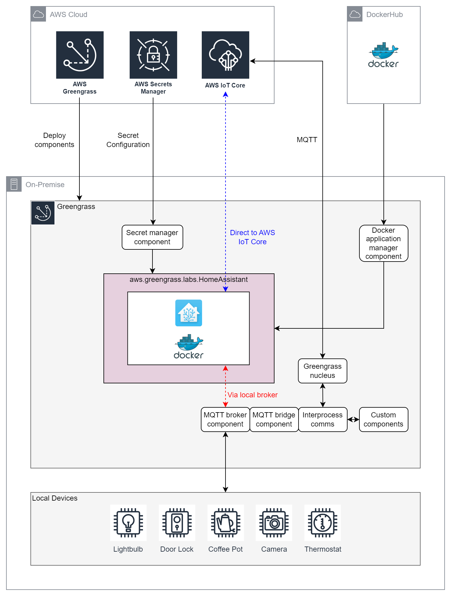

# AWS IoT Greengrass V2 Community Component - Home Assistant

[Home Assistant](https://www.home-assistant.io/) is an [open-source home automation solution](https://github.com/home-assistant/core). 

This repository facilitates packaging Home Assistant into an [AWS IoT Greengrass V2](https://docs.aws.amazon.com/greengrass/v2/developerguide/what-is-iot-greengrass.html) component named **aws.greengrass.labs.HomeAssistant**. This enables use cases where the customer reqires Home Assistant for local control, but also requires integration with AWS services at the edge and in the cloud. 

Using the Home Assistant [MQTT Integration](https://www.home-assistant.io/integrations/mqtt/), Home Assistant can publish and subscribe to topics on either or both of [AWS IoT Core](https://docs.aws.amazon.com/iot/latest/developerguide/mqtt.html) and the Greengrass local [Moquette MQTT broker](https://docs.aws.amazon.com/greengrass/v2/developerguide/mqtt-broker-moquette-component.html). This allows integration with the cloud, other Greengrass components on the same device and/or with other devices on the local network. Home Assistant can therefore leverage [AWS-managed Greengrass components](https://docs.aws.amazon.com/greengrass/v2/developerguide/public-components.html), [custom Greengrass components](https://docs.aws.amazon.com/greengrass/v2/developerguide/develop-greengrass-components.html), [community Greengrass components](https://github.com/orgs/awslabs/teams/aws-greengrass-labs/repositories) and AWS services to deliver powerful home automation solutions that extend Home Assistant's capabilities.

# Table of Contents
* [Architecture](#architecture)
* [Repository Contents](#repository-contents)
* [Requirements and Prerequisites](#requirements-and-prerequisites)
  * [Greengrass Core Device](#greengrass-core-device)
    * [Platform](#platform)
    * [Edge Runtime](#edge-runtime)
    * [Docker Requirements](#docker-requirements)
    * [Python Requirements](#python-requirements)
  * [Greengrass Cloud Services](#greengrass-cloud-services)
    * [Core Device Role](#core-device-role)
  * [Developer Machine](#developer-machine)
    * [AWS CLI](#aws-cli)
    * [Python](#python)
    * [Bash](#bash)
* [Getting Started](#getting-started)
  * [Quickstart](#quickstart)
  * [Slowstart](#slowstart)
    * [Manual Deployment](#manual-deployment)
    * [Example Execution](#example-execution)
    * [CI/CD Pipeline](#cicd-pipeline)
* [Home Assistant Configuration Tips](#home-assistant-configuration-tips)
  * [Defaults](#defaults)
  * [Production Deployments](#production-deployments)
  * [Machine Specific Images](#machine-specific-images)
  * [MQTT](#mqtt)
    * [AWS IoT Core](#aws-iot-core)
    * [Greengrass Moquette MQTT Broker](#greengrass-moquette-mqtt-broker)
  * [HTTPS](#https)
* [Development](#development)
  * [Static Analysis](#static-analysis)
  * [Unit Tests](#unit-tests)

# Architecture

An overview of the system architecture is presented below.



The **aws.greengrass.labs.HomeAssistant** component is a thin wrapper around a conventional [Home Assistant Container](https://www.home-assistant.io/installation/) deployment. 

Home Assistant Container is delivered as a Docker image on [Docker Hub](https://hub.docker.com/r/homeassistant/home-assistant) and on [GitHub](https://github.com/orgs/home-assistant/packages?repo_name=core). This Greengrass component downloads the selected Docker image from Docker Hub or GitHub with the help of the [Docker application manager](https://docs.aws.amazon.com/greengrass/v2/developerguide/docker-application-manager-component.html) managed component.

Home Assistant configuration files are [designed to be split](https://www.home-assistant.io/docs/configuration/splitting_configuration/) as the solution scales. By convention, [secrets are typically separated from the rest of the configuration](https://www.home-assistant.io/docs/configuration/secrets/) and stored in a file named **secrets.yaml**. This Greengrass component handles **secrets.yaml** by storing it as a secret in [AWS Secrets Manager](https://aws.amazon.com/secrets-manager/) in the cloud. At the edge, this component retrieves the **secrets.yaml** file from Secrets Manager with the help of the [Secret manager](https://docs.aws.amazon.com/greengrass/v2/developerguide/secret-manager-component.html) managed component. From the developer machine, the contents of the **secrets** directory are placed into the Secrets Manager secret by calling **create_config_secret.py**.

As shown in **blue** on the architecture diagram, Home Assistant can use its [MQTT integration](https://www.home-assistant.io/integrations/mqtt/) to connect directly to AWS IoT Core. Alternatively, and more powerfully, Home Assistant can instead connect to the local Greengrass [Moquette MQTT broker](https://docs.aws.amazon.com/greengrass/v2/developerguide/mqtt-broker-moquette-component.html). This is option is shown in **red**. If Home Assistant and other devices on the local network are registered as [Local Client Devices with Greengrass](https://aws.amazon.com/blogs/iot/implementing-local-client-devices-with-aws-iot-greengrass/), this architecture allows Home Assistant to communicate with those [other devices via the broker](https://docs.aws.amazon.com/greengrass/v2/developerguide/interact-with-local-iot-devices.html) **and** with [other Greengrass components via Greengrass Interprocess Communication](https://docs.aws.amazon.com/greengrass/v2/developerguide/ipc-publish-subscribe.html). Furthermore, the [MQTT bridge](https://docs.aws.amazon.com/greengrass/v2/developerguide/mqtt-bridge-component.html) connects AWS IoT Core as an additional publisher and subscriber, facilitating cloud integration as well.

# Repository Contents

| Item                          | Description                                                                                           |
| ----------------------------- | ----------------------------------------------------------------------------------------------------- |
| /artifacts                    | Greengrass V2 component artifacts that run on the Greengrass edge runtime.                            |
| /cicd                         | CDK Typescript app for a CodePipeline CI/CD pipeline.                                                 |
| /images                       | Images for README files.                                                                              |
| /libs                         | Python libraries shared by Python scripts.                                                            |
| /recipes                      | Greengrass V2 component recipe templates.                                                             |
| /secrets                      | Home Assistant secrets (secrets.yaml and optional certificates)                                       |
| /tests                        | Pytest unit tests.                                                                                    |
| create_component_version.py   | Creates a new version of the Home Assistant component in the Greengrass cloud service.                |
| create_config_secret.py       | Creates or updates the Home Assistant configuration secret in Secrets Manager.                        |
| deploy_component_version.py   | Deploys a component version to the Greengrass core device target.                                     |
| quickstart.sh                 | Creates a secret, and creates and deploys a component version in a single operation.                  |

# Requirements and Prerequisites

## Greengrass Core Device

### Platform

This component requires that the Greengrass device be running a Linux operating system. It [supports all architectures supported by Greengrass itself](https://docs.aws.amazon.com/greengrass/v2/developerguide/setting-up.html#greengrass-v2-supported-platforms).

### Edge Runtime

The [Greengrass edge runtime needs to be deployed](https://docs.aws.amazon.com/greengrass/v2/developerguide/getting-started.html) to a suitable machine, virtual machine or EC2 instance. Please see the [Home Assistant installation guide](https://www.home-assistant.io/installation/) for information on the resources required.

### Docker Requirements

Your core device must [meet the requirements to run Docker containers using Docker Compose and Docker Hub](https://docs.aws.amazon.com/greengrass/v2/developerguide/run-docker-container.html).

### Python Requirements

This component requires both **python3** and **pip3** to be installed on the core device.

## Greengrass Cloud Services

### Core Device Role

This component downloads artifacts from an S3 bucket named **greengrass-home-assistant-ACCOUNT-REGION**. Therefore your Greengrass core device role must allow the **s3:GetObject** permission for this bucket. For more information: https://docs.aws.amazon.com/greengrass/v2/developerguide/device-service-role.html#device-service-role-access-s3-bucket

Additionally, this component downloads sensitive Home Assistant configuration from Secrets Manager. Therefore your Greengrass core device role must also allow the **secretsmanager:GetSecretValue** permission for the **greengrass=home-assistant-ID** secret. 

Policy template to add to your device role (substituting correct values for ACCOUNT, REGION and ID):

```
{
  "Version": "2012-10-17",
  "Statement": [
    {
      "Effect": "Allow",
      "Action": [
        "s3:GetObject"
      ],
      "Resource": "arn:aws:s3:::greengrass-home-assistant-ACCOUNT-REGION/*"
    },
    {
      "Effect": "Allow",
      "Action": [
        "secretsmanager:GetSecretValue"
      ],
      "Resource": "arn:aws:secretsmanager:REGION:ACCOUNT:secret:greengrass-home-assistant-ID"
    }
  ]
}
```

## Developer Machine

### AWS CLI

It may be necessary to [upgrade your AWS CLI](https://docs.aws.amazon.com/systems-manager/latest/userguide/getting-started-cli.html) if you wish to use any **greengrassv2** commands, as these are relatively recent additions to the CLI.

### Python

Most of the scripts in this repository are Python scripts. They are Python 3 scripts and hence **python3** and **pip3** are required.

Package dependencies can be resolved as follows:

```
pip3 install -r requirements.txt
```

Please consider to use a [virtual environment](https://docs.python.org/3/library/venv.html).

### Bash

The **quickstart.sh** script is a Bash script. If using a Windows machine, you will need a Bash environment. Alternatively you can run the Python scripts individually.

# Getting Started

Here we define two ways to get started: Quickstart or Slowstart.

All scripts used should be compatible with Linux, Mac or Windows operating systems, provided a Bash environment is available.

## Quickstart

The **quickstart.sh** bash script is supplied to help you get going fast. It rolls the constituent steps up into a single command.

Before running the script, users must deploy Greengrass V2 to a physical machine, virtual machine or EC2 instance, meeting all of the prerequisites including [the requirements to run Docker containers using Docker Compose and Docker Hub](https://docs.aws.amazon.com/greengrass/v2/developerguide/run-docker-container.html).

It is not necessary to perform any Hme Assistant configuration changes. Out of the box, Home Assistant will be deployed with the latest stable version and with default configuration.

The Quickstart script will:

1. Install required Python packages on your developer machine.
2. Upload the default (null) secret configuration (**secrets.yaml**) to a secret in Secrets Manager, creating the secret.
3. Create a new component version in Greengrass cloud services, with artifacts in an S3 bucket.
4. Prompt you to add permissions for the configuration secret and artifacts bucket to the Greengrass core device role. 
5. Deploy the new component version to the Greengrass core.

The script accepts 3 arguments:

1. AWS region.
2. Component version. (Semantic **major.minor.patch**.)
3. Greengrass Core device name.

Example execution:

```
bash quickstart.sh ap-southeast-1 1.0.0 MyCoreDeviceThingName
```
## Slowstart

For any serious use of the component, Quickstart shall not be appropriate.

### Manual Deployment
If not using Quickstart, you must perform the following steps:

1. Deploy the Greengrass runtime to your machine, virtual machine or EC2 instance, meeting all of the prerequisites
2. Select your desired Home Assistant Container image and tag by modifying **artifacts/docker-compose.yml**.
3. Configure Home Assistant by modifying the configuration YAML files in **artifacts/config** and **secrets** as desired. 
4. Subject to your configuration, generate self-signed TLS certificates if required and add them to the **secrets** directory.
5. If MQTT integration with AWS IoT Core or the Greengrass MQTT broker is configured, take the appropriate steps in the AWS cloud.
6. Subject to your configuration, add any required MQTT-related certificates to the **secrets** directory.
7. Run **create_config_secret.py** to create the configuration secret in Secrets Manager.
8. Run **create_component_version.py** to create a component version in Greengrass cloud service, and upload artifacts to S3.
9. Add permissions for the configuration secret and artifacts bucket to the Greengrass core device role. 
10. Run **deploy_component_version.py** to deploy the new component version to your Greengrass device. 

For iterative configuration changes, repeat steps as appropriate.

### Example Execution

Example of steps 7, 8 and 10:

```
python3 create_config_secret.py ap-southeast-1
python3 create_component_version.py 1.0.0 ap-southeast-1
python3 deploy_component_version.py 1.0.0 ap-southeast-1 MyCoreDeviceThingName
```

This example:

1. Operates in AWS region **ap-southeast-1**.
2. Creates and deploys component version **1.0.0** to Greengrass core device **MyCoreDeviceThingName**.

### CI/CD Pipeline

This repository offers a CodePipeline [CI/CD pipeline](cicd/README.md) as a CDK application. This can be optionally deployed to the same account as the Greengrass core.

This CI/CD pipeline automates steps 8 and 10. With the pipeline deployed, users can make iterative configuration changes, update the configuration secret using **create_config_secret.py**, and then trigger the CI/CD pipeline to handle the rest.

# Home Assistant Configuration Tips

Configuration of Home Assistant can be done predominantly through its user interface. However, it can also be configured using the YAML files in **artifacts/config** and **secrets**. Please consult the [Home Assistant configuration documentation](https://www.home-assistant.io/docs/configuration/) for details.

## Defaults

The configuration files in this projects are merely skeleton files. Home Assistant can be deployed with these files, yielding a greenfields installation. 

## Production Deployments

Production deployments should reference a specific Docker image tag (not just **latest**) in **artifacts/docker-compose.yml**.

## Machine Specific Images

Docker images from Home Assistant's GitHub releases can be used directly as the image in **artifacts/docker-compose.yml**.

## MQTT

Here we present Home Assistant configuration options to integrate with AWS IoT Core and AWS IoT Greengrass.

### AWS IoT Core

We can use the [MQTT Integration](https://www.home-assistant.io/integrations/mqtt/) to connect Home Assistant directly to AWS IoT Core. Firstly create a Thing representing Home Assistant, and obtain the device certificate, private key and CA certificate. These certificates and keys should NOT be committed to your source repository and thus we instead disseminate them to Greengrass using Secrets Manager. The certificates and key should be added to the **secrets** directory. An example structure:

```
secrets/secrets.yaml
secrets/mqtt/AmazonRootCA1.pem
secrets/mqtt/dc536a53c3fcbce54833f9d90ab3ef1bd54523b4f371f60a811c0970dc8d4d82-certificate.pem.crt
secrets/mqtt/dc536a53c3fcbce54833f9d90ab3ef1bd54523b4f371f60a811c0970dc8d4d82-private.pem.key

```

Obtain the AWS IoT Core endpoint:

```bash
aws iot describe-endpoint
{
    "endpointAddress": "0123456789abcd.iot.ap-southeast-1.amazonaws.com"
}
```

And add that to a secret in **secrets/secrets.yaml**:

```yaml
aws_iot_core_endpoint: 0123456789abcd.iot.ap-southeast-1.amazonaws.com
```

Update the secret in Secrets Manager:

```bash
python3 create_config_secret.py ap-southeast-1
Files to add to secret: ['secrets/secrets.yaml', 'secrets/mqtt/dc536a53c3fcbce54833f9d90ab3ef1bd54523b4f371f60a811c0970dc8d4d82-certificate.pem.crt', 'secrets/mqtt/dc536a53c3fcbce54833f9d90ab3ef1bd54523b4f371f60a811c0970dc8d4d82-private.pem.key', 'secrets/mqtt/AmazonRootCA1.pem']
Updating the Home Assistant secret greengrass-home-assistant
Successfully updated the Home Assistant secret
```

Update the **artifacts/config/configuration.yaml** to add the AWS IoT Core connection information for the MQTT integration within Home Assistant (where the Thing name is "home-assistant"):

```yaml
# Example configuration.yaml entry for connecting to IoT Core
mqtt:
  broker: !secret aws_iot_core_endpoint
  port: 8883
  certificate: /config/mqtt/AmazonRootCA1.pem
  client_key: /config/mqtt/dc536a53c3fcbce54833f9d90ab3ef1bd54523b4f371f60a811c0970dc8d4d82-private.pem.key
  client_cert: /config/mqtt/dc536a53c3fcbce54833f9d90ab3ef1bd54523b4f371f60a811c0970dc8d4d82-certificate.pem.crt
  client_id: home-assistant
  tls_insecure: false
  tls_version: '1.2'
  protocol: '3.1.1'
```

And then create and deploy a new component version. 

### Greengrass Moquette MQTT Broker

Greengrass V2 includes an [AWS-managed Moquette MQTT broker component](https://docs.aws.amazon.com/greengrass/v2/developerguide/mqtt-broker-moquette-component.html). This can be deployed to Greengrass to [allow Greengrass components and devices on your local network to communicate with each other](https://docs.aws.amazon.com/greengrass/v2/developerguide/interact-with-local-iot-devices.html), without relying on an internet connection to AWS IoT Core. 

Using the [MQTT Integration](https://www.home-assistant.io/integrations/mqtt/), Home Assistant can be a "local IoT device" that connects to the Moquette broker. Additionally, Greengrass V2 includes an [AWS-managed MQTT Bridge component](https://docs.aws.amazon.com/greengrass/v2/developerguide/mqtt-bridge-component.html). When this is also deployed, Home Assistant can use its MQTT Integration to communicate with local devices, Greengrass components and AWS IoT Core; the best of all worlds.

To begin, [update the Greengrass deployment to add the necessary components](https://docs.aws.amazon.com/greengrass/v2/developerguide/client-devices-tutorial.html) to your Greengrass core device:

* [MQTT broker (Moquette)](https://docs.aws.amazon.com/greengrass/v2/developerguide/mqtt-broker-moquette-component.html)
* [MQTT bridge](https://docs.aws.amazon.com/greengrass/v2/developerguide/mqtt-bridge-component.html)
* [Client device auth](https://docs.aws.amazon.com/greengrass/v2/developerguide/client-device-auth-component.html)
* [IP detector](https://docs.aws.amazon.com/greengrass/v2/developerguide/ip-detector-component.html)

As with connecting to AWS IoT Core, the device certificate and key should be added to your secrets. However, instead of the Amazon Root CA certificate being added for authenticating AWS IoT Core, you instead need the CA generated by the component installations; this can be found at **/greengrass/v2/work/aws.greengrass.clientdevices.Auth/ca.pem** on your Greengrass device and copied to your **secrets** directory on your developer machine. These certificates and keys should NOT be committed to your source repository and thus we instead disseminate them to Greengrass using Secrets Manager.

```
secrets/secrets.yaml
secrets/mqtt/ca.pem
secrets/mqtt/dc536a53c3fcbce54833f9d90ab3ef1bd54523b4f371f60a811c0970dc8d4d82-certificate.pem.crt
secrets/mqtt/dc536a53c3fcbce54833f9d90ab3ef1bd54523b4f371f60a811c0970dc8d4d82-private.pem.key
```

Update the secrets in Secrets Manager:

```bash
python3 create_config_secret.py ap-southeast-1
Files to add to secret: ['secrets/secrets.yaml', 'secrets/mqtt/dc536a53c3fcbce54833f9d90ab3ef1bd54523b4f371f60a811c0970dc8d4d82-certificate.pem.crt', 'secrets/mqtt/dc536a53c3fcbce54833f9d90ab3ef1bd54523b4f371f60a811c0970dc8d4d82-private.pem.key', 'secrets/mqtt/ca.pem']
Updating the Home Assistant secret greengrass-home-assistant
Successfully updated the Home Assistant secret
```

Update the **artifacts/config/configuration.yaml** to add the Moquette broker connection information for the MQTT integration within Home Assistant (where the Thing name is "home-assistant"):

```yaml
# Example configuration.yaml entry for connecting to the Greengrass MQTT broker (Moquette)
mqtt:
  # Moquette is on the same machine as Home Assistant
  broker: localhost
  port: 8883
  # CA certificate copied from /greengrass/v2/work/aws.greengrass.clientdevices.Auth/ca.pem
  certificate: /config/mqtt/ca.pem
  client_key: /config/mqtt/dc536a53c3fcbce54833f9d90ab3ef1bd54523b4f371f60a811c0970dc8d4d82-private.pem.key
  client_cert: /config/mqtt/dc536a53c3fcbce54833f9d90ab3ef1bd54523b4f371f60a811c0970dc8d4d82-certificate.pem.crt
  client_id: home-assistant
  tls_insecure: false
  tls_version: '1.2'
  protocol: '3.1.1'
```

And then create and deploy a new component version.

## HTTPS

Home Assistant supports [secure remote access](https://www.home-assistant.io/docs/configuration/securing/) if you have a domain name and/or a static IP address. 

Alternatively, you can enable HTTPS on your local network using self-signed certificates. These can be generated using **openssl** as follows:

```bash
openssl req -sha256 -addext "subjectAltName = IP:xxx.xxx.xxx.xxx" -newkey rsa:4096 -nodes -keyout privkey.pem -x509 -days 730 -out fullchain.pem
```

These certificates should NOT be committed to your source repository and thus we instead disseminate them to Greengrass using Secrets Manager. The certificates should be added to the **secrets** directory. An example structure:

```
secrets/secrets.yaml
secrets/https/fullchain.pem
secrets/https/privkey.pem

```

Update the secrets in Secrets Manager:

```bash
python3 create_config_secret.py ap-southeast-1
Files to add to secret: ['secrets/secrets.yaml', 'secrets/https/fullchain.pem', 'secrets/https/privkey.pem']
Updating the Home Assistant secret greengrass-home-assistant
Successfully updated the Home Assistant secret
```

And then create and deploy a new component version.

# Development

## Static Analysis

Static analysis is performed using [Pylint](https://pylint.org/). Example execution:

```
pylint artifacts libs tests *.py
```

## Unit Tests

Unit tests are performed using [pytest](https://pytest.org/) and [moto](https://github.com/spulec/moto).

Example execution:

```
pytest --cov=artifacts --cov=.
```

Producing an HTML coverage report into the **htmlcov** directory:

```
pytest --cov=artifacts --cov=. --cov-report=html
```

Producing a coverage report for just the on-device artifacts (100% coverage):

```
pytest --cov=artifacts
```
