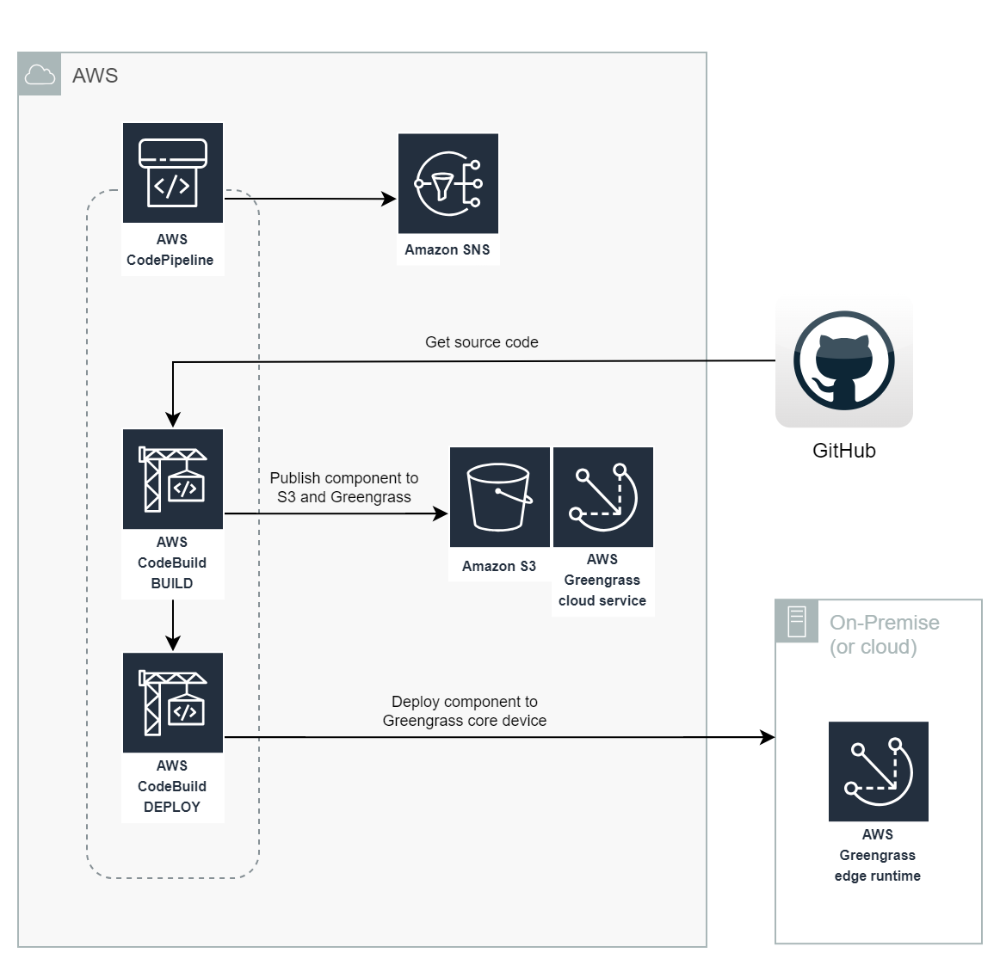

# CI/CD Pipeline Stack

The CI/CD pipeline for the AWS Greengrass Home Assistant component is a TypeScript CDK application that deploys a CodePipeline pipeline. 

# Table of Contents
* [Architecture](#architecture)
* [How to](#how-to)
    * [Prerequisites](#prerequisites)
    * [Build the application](#build-the-application)
    * [Run unit tests](#run-unit-tests)
    * [Context variables](#context-variables)
    * [Synthesize a CloudFormation template](#synthesize-a-cloudformation-template)
    * [Deploy the pipeline](#deploy-the-pipeline)

# Architecture

The pipeline consists of two stages: build and deploy. The build stage creates a new component version and the deploy stage deploys that version to the Greengrass Edge runtime. 



## Source Code

The pipeline consumes a repository hosted in GitHub, GitHub Enterprise Server or Bitbucket. You need to create an [AWS CodeStar connection](https://docs.aws.amazon.com/dtconsole/latest/userguide/connections.html). 

As this project is hosted in GitHub, the most common scenario is that you will fork the repository in GitHub and [create a CodeStar connection to the forked repository in GitHub](https://docs.aws.amazon.com/dtconsole/latest/userguide/connections-create-github.html). The CodeStar connection ID can then be used in the [CDK context](#context-variables).

## Versioning

The pipeline uses the the **major.minor** part of the component version defined in [gdk-config.json](../gdk-config.json), and appends the [AWS CodeBuild build number](https://docs.aws.amazon.com/codebuild/latest/userguide/build-env-ref-env-vars.html) as the **patch** version. Accordingly you can't use the `NEXT_PATCH` feature of the [Greengrass Development Kit (GDK)](https://docs.aws.amazon.com/greengrass/v2/developerguide/greengrass-development-kit-cli.html) with the CI/CD pipeline.

## Notifications

The pipeline publishes success or failure notifications to an SNS topic named **gg-ha-cicd-notification**.

## Test Reports

Unit test reports are stored as build artifacts and [JUnit compatible reports in CodeBuild](https://docs.aws.amazon.com/codebuild/latest/userguide/test-reporting.html). 

# How to

## Prerequisites

Follow the [Getting started with the AWS SDK guide (for Typescript)](https://docs.aws.amazon.com/cdk/latest/guide/getting_started.html) to install CDK and bootstrap your environment.

## Build the application

Compile TypeScript to JS.

```
npm run build
```
## Run unit tests

Uses the Jest framework.

```
npm run test
```

## Context variables

The CDK concept of [context](https://docs.aws.amazon.com/cdk/v2/guide/context.html) is used to configure the CI/CD pipeline.

Synthesis and deployment of the stack requires the following context variables:

| Name               | Description                                                                                         | Default |
| ------------------ | --------------------------------------------------------------------------------------------------- | ------- |
| ConnectionId       | The CodeStar connection ID of the repo hosted in GitHub, BitBucket and GitHub Enterprise Server.    | None    |
| OwnerName          | The name of the owner of the repo hosted in GitHub, BitBucket and GitHub Enterprise Server.         | None    |
| RepositoryName     | The name of the repository containing the source code.                                              | aws-greengrass-labs-component-for-home-assistant |
| BranchName         | The name of the branch to use in the repository.                                                    | main    |
| GreengrassCoreName | The name of the Greengrass Core device that the component shall be deployed to.                     | None    |

Default context values are defined in [cdk.json](cdk.json). Variables without a default value must be supplied in the command line of every synthesis or deployment, or added to the default context in your cloned or forked repository. 

## Synthesize a CloudFormation template 

Example synthesis:

```
cdk synth -c ConnectionId=feedface-3333-bead-4444-0123456789ab -c OwnerName=MyOwnerName -c RepositoryName=aws-greengrass-labs-component-for-home-assistant -c BranchName=main -c GreengrassCoreName=raspberrypi4-ggv2
```

## Deploy the pipeline

Example deployment:

```
cdk deploy -c ConnectionId=feedface-3333-bead-4444-0123456789ab -c OwnerName=MyOwnerName -c RepositoryName=aws-greengrass-labs-component-for-home-assistant -c BranchName=main -c GreengrassCoreName=raspberrypi4-ggv2
```
